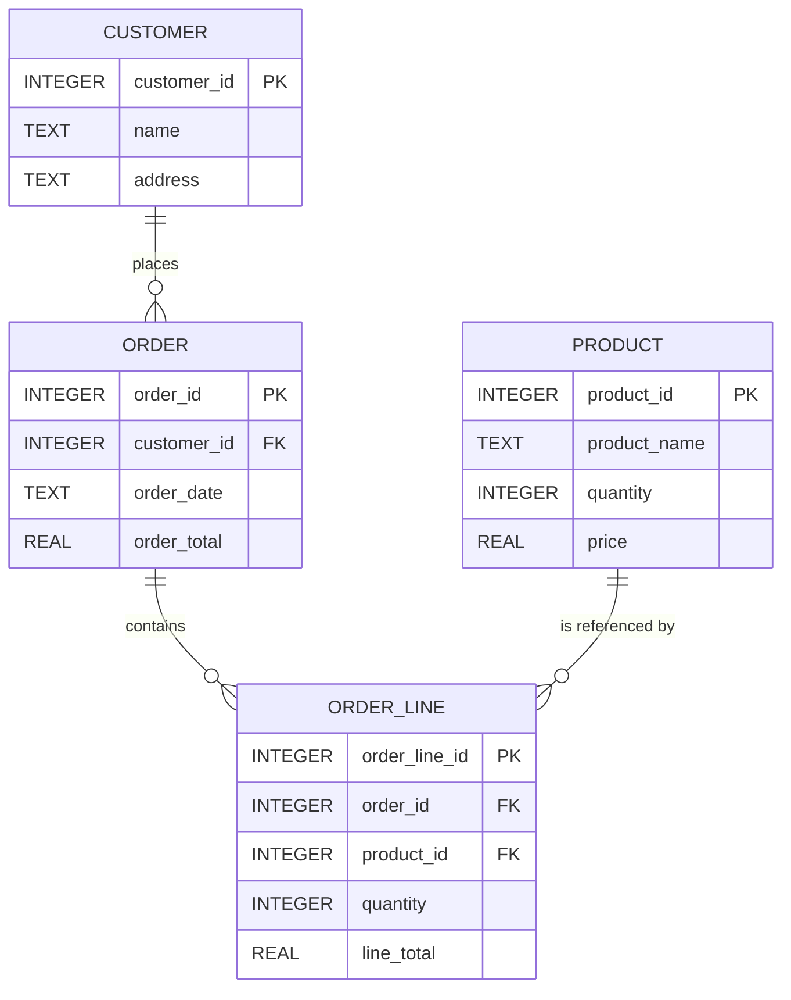
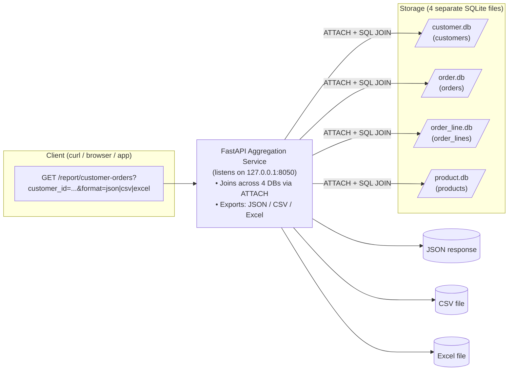

# Demo Aggregation API (Customer–Orders)

This project demonstrates a small **Python REST API** that aggregates across
four separate SQLite databases (`customer.db`, `product.db`, `order.db`, `order_line.db`)
to provide customer order reports in **JSON**, **CSV**, or **Excel**.

---

## 1. Setup

Clone the repo and install dependencies (Python 3.10+ recommended):

```bash
python -m venv venv
source venv/bin/activate   # Windows: venv\Scripts\activate
pip install -r requirements.txt
```

2. Create Demo Databases

Run the setup script once to generate sample data:

python setup_db.py


This will create:

customer.db (customers)

product.db (products)

order.db (orders)

order_line.db (order lines)

3. Start the API
python app.py


The API runs on http://127.0.0.1:8050

4. Try it Out

JSON output

http://127.0.0.1:8050/report/customer-orders?customer_id=1&format=json


CSV download

http://127.0.0.1:8050/report/customer-orders?customer_id=1&format=csv


Excel download

http://127.0.0.1:8050/report/customer-orders?customer_id=1&format=excel


No orders? You’ll get an empty dataset with headers.

5. Diagrams

GitHub natively renders Mermaid diagrams:

Database Schema


API & Data Flow

