# Demo Aggregation API (Customer–Orders)

This project demonstrates a small **Python REST API** that aggregates across
four separate SQLite databases (`customer.db`, `product.db`, `order.db`, `order_line.db`)
to provide customer order reports in **JSON**, **CSV**, or **Excel**.

---

## 1. Setup

Clone the repo and install dependencies (Python 3.10+ recommended):

```bash
python -m venv venv
source venv/bin/activate   # Windows: venv\Scripts\activate
pip install -r requirements.txt
```

## 2. Create Demo Databases

Run the setup script once to generate sample data:

python setup_db.py


This will create:

customer.db (customers)

product.db (products)

order.db (orders)

order_line.db (order lines)

## 3. Start the API
python app.py


The API runs on http://127.0.0.1:8050

## 4. Try it Out

## JSON output
http://127.0.0.1:8050/report/customer-orders?customer_id=1&format=json

## CSV download
http://127.0.0.1:8050/report/customer-orders?customer_id=1&format=csv

## Excel download
http://127.0.0.1:8050/report/customer-orders?customer_id=1&format=excel

No orders? You’ll get an empty dataset with headers.

## 5. Diagrams

GitHub natively renders Mermaid diagrams:

## Database Schema


## 6. API & Data Flow

```mermaid
flowchart LR
  subgraph Client["Client"]
    req["curl / browser / app\n→ GET /report/customer-orders?..."]
  end

  req --> apiSvc["FastAPI Aggregation Service\n127.0.0.1:8050\n• Joins across 4 DBs\n• Exports JSON / CSV / Excel"]

  subgraph DBs["SQLite Databases"]
    dbCust[/"customer.db"/]
    dbOrd[/"order.db"/]
    dbOL[/"order_line.db"/]
    dbProd[/"product.db"/]
  end

  apiSvc --> dbCust
  apiSvc --> dbOrd
  apiSvc --> dbOL
  apiSvc --> dbProd

  apiSvc --> respJSON[(JSON)]
  apiSvc --> respCSV[(CSV)]
  apiSvc --> respXLSX[(Excel)]
```



## 7. 🚀 Live Demo (render.com)

The API is deployed on **Render (free tier)**:  
👉 https://python-api-demo-with-database.onrender.com

⚠️ **Note:** On the free tier, the instance “sleeps” after ~15 minutes of inactivity.  
When you visit a link, it may take **30–60 seconds** to spin back up before the response appears.

### Interactive Documentation
- **Swagger UI:** [https://python-api-demo-with-database.onrender.com/docs](https://python-api-demo-with-database.onrender.com/docs)  
- **ReDoc:** [https://python-api-demo-with-database.onrender.com/redoc](https://python-api-demo-with-database.onrender.com/redoc)  
- **OpenAPI JSON:** [https://python-api-demo-with-database.onrender.com/openapi.json](https://python-api-demo-with-database.onrender.com/openapi.json)  
    
    Expected Result:
      ```
        {"openapi":"3.1.0","info":{"title":"Demo Aggregation API","version":"0.1.0"},"paths":{"/health":{"get":{"summary":"Health","operationId":"health_health_get","responses":{"200":{"description":"Successful Response","content":{"application/json":{"schema":{}}}}}}},"/report/customer-orders":{"get":{"summary":"Customer Orders Report","operationId":"customer_orders_report_report_customer_orders_get","parameters":[{"name":"customer_id","in":"query","required":true,"schema":{"type":"integer","description":"Customer number","title":"Customer Id"},"description":"Customer number"},{"name":"format","in":"query","required":false,"schema":{"type":"string","pattern":"^(json|csv|excel)$","description":"json|csv|excel","default":"json","title":"Format"},"description":"json|csv|excel"}],"responses":{"200":{"description":"Successful Response","content":{"application/json":{"schema":{}}}},"422":{"description":"Validation Error","content":{"application/json":{"schema":{"$ref":"#/components/schemas/HTTPValidationError"}}}}}}}},"components":{"schemas":{"HTTPValidationError":{"properties":{"detail":{"items":{"$ref":"#/components/schemas/ValidationError"},"type":"array","title":"Detail"}},"type":"object","title":"HTTPValidationError"},"ValidationError":{"properties":{"loc":{"items":{"anyOf":[{"type":"string"},{"type":"integer"}]},"type":"array","title":"Location"},"msg":{"type":"string","title":"Message"},"type":{"type":"string","title":"Error Type"}},"type":"object","required":["loc","msg","type"],"title":"ValidationError"}}}}
        ```

- **Health check:** [https://python-api-demo-with-database.onrender.com/health](https://python-api-demo-with-database.onrender.com/health)  

    For the health check you should see: `{"status":"ok"}`. 

### Example Endpoints
- JSON (customer 1):  
  [https://python-api-demo-with-database.onrender.com/report/customer-orders?customer_id=1&format=json](https://python-api-demo-with-database.onrender.com/report/customer-orders?customer_id=1&format=json)

    Response (Pretty Print) should yield these results:
    ```
    [
      {
        "product_id": 10,
        "order_date": "2025-09-14",
        "product_description": "Widget A",
        "quantity": 2,
        "price": 9.99,
        "total_amount": 19.98
      },
      {
        "product_id": 11,
        "order_date": "2025-09-14",
        "product_description": "Widget B",
        "quantity": 1,
        "price": 19.5,
        "total_amount": 19.5
      },
      {
        "product_id": 12,
        "order_date": "2025-09-14",
        "product_description": "Gadget C",
        "quantity": 1,
        "price": 49,
        "total_amount": 49
      }
    ]
    ```

- CSV (customer 1):  
  [https://python-api-demo-with-database.onrender.com/report/customer-orders?customer_id=1&format=csv](https://python-api-demo-with-database.onrender.com/report/customer-orders?customer_id=1&format=csv)

    Output CSV should look like [this example CSV file](sample-output/customer_1_orders.csv).

- Excel (customer 1):  
  [https://python-api-demo-with-database.onrender.com/report/customer-orders?customer_id=1&format=excel](https://python-api-demo-with-database.onrender.com/report/customer-orders?customer_id=1&format=excel)

    Output Excel file should look like [this example XLSX file](sample-output/customer_1_orders.xlsx).

- No orders (customer 999):  
  [https://python-api-demo-with-database.onrender.com/report/customer-orders?customer_id=999&format=json](https://python-api-demo-with-database.onrender.com/report/customer-orders?customer_id=999&format=json)

    Output JSON should be empty, i.e., you should see `[]` as the response.

## 8. 📦 Local Development

```bash
# Clone repo and install dependencies
python -m venv venv
source venv/bin/activate   # Windows: venv\Scripts\activate
pip install -r requirements.txt

# Create demo databases
python setup_db.py

# Run API (localhost:8050 by default)
python app.py
